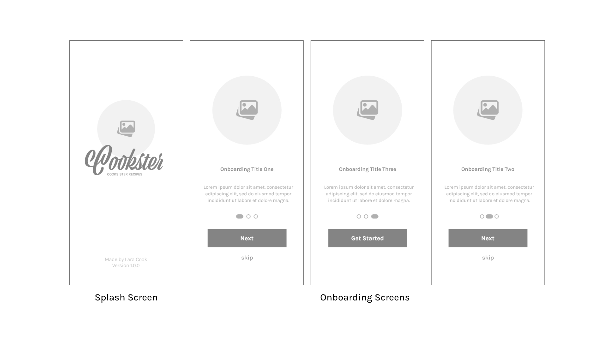

<!--

***
***
*** To avoid retyping too much info. Do a search and replace for the following:
*** LaraCassandra, Cookster, twitter_handle, 190218@virtualwindow.co.za, project_title, project_description
-->


<!-- PROJECT SHIELDS -->
<!--
*** I'm using markdown "reference style" links for readability.
*** Reference links are enclosed in brackets [ ] instead of parentheses ( ).
*** See the bottom of this document for the declaration of the reference variables
*** for contributors-url, forks-url, etc. This is an optional, concise syntax you may use.
*** https://www.markdownguide.org/basic-syntax/#reference-style-links
-->


<!-- PROJECT LOGO -->
<br />
<p align="center">
  <a href="https://github.com/LaraCassandra/Cookster">
    
  </a>

  <h3 align="center">Cookster</h3>

  <p align="center">
    A Collection of Cooksister Recipes
    <br />
    <a href="https://github.com/LaraCassandra/Cookster"><strong>Explore the docs »</strong></a>
    <br />
    <br />
</p>


<!-- TABLE OF CONTENTS -->
<details open="open">
  <summary><h2 style="display: inline-block">Table of Contents</h2></summary>
  <ol>
    <li>
      <a href="#about-the-project">About The Project</a>
      <ul>
        <li><a href="#built-with">Built With</a></li>
      </ul>
    </li>
    <li>
      <a href="#getting-started">Getting Started</a>
      <ul>
        <li><a href="#prerequisites">Prerequisites</a></li>
        <li><a href="#installation">Installation</a></li>
      </ul>
    </li>
    <li><a href="#features-and-functions">Features and Functions</a></li>
    <li><a href="#concept-process">Concept Process</a>
      <ul>
        <li><a href="#moodboard">Moodboard</a></li>
        <li><a href="#colourpalette">Colour Palette</a></li>
        <li><a href="#wireframes">Wireframes</a></li>
      </ul>
    </li>
    <li><a href="#development-implementation">Development Implementation</a>
        <ul>
        <li><a href="#userflow-diagram">Userflow Diagram</a></li>
        <li><a href="#functionality">Functionality</a></li>
        <li><a href="#designarchitecture">Design Architecture</a></li>
        <li><a href="#futurechanges">Future Changes</a></li>
        </ul>
    </li>
    <li><a href="#videodemonstration">Video Demonstration</a></li>
    <li><a href="#roadmap">Road Map</a></li>
    <li><a href="#contributing">Contributing</a></li>
    <li><a href="#authors">Authors</a></li>
    <li><a href="#contact">Contact</a></li>
    <li><a href="#license">License</a></li>
    <li><a href="#acknowledgements">Acknowledgements</a></li>
  </ol>
</details>


<!-- ABOUT THE PROJECT -->
## About The Project

<br>


<br>

Cookster is a library application that holds all the secrets to the Cook Family Recipes... with that being said, don't abuse this wonderful privledge you have been granted :wink:

Jokes aside, Cookster is a minimalistic application where you are able to see all recipes, search for recipes and even change to light or dark mode for your convenience.

<br>

### Built With

Cookster is an iOS application built using:

* [Swift](https://developer.apple.com/swift/) Language
* [SwiftUI](https://developer.apple.com/xcode/swiftui/) to create views, controls and layout structures

* [Xcode](https://developer.apple.com/xcode/) as IDE
* [Github](https://github.com/) for Git Version Control


<br>

<!-- GETTING STARTED -->
## Getting Started

Let's get started, simply follow the steps below and you'll have your own copy up and running to do with whatever your heart may desire.


### Prerequisites

This project requires that you are on a mac and have a stable version of Xcode, but no worries, you can [download Xcode here](https://developer.apple.com/xcode/)!

### Installation

There are a few ways you can go about cloning this repo, check it out:

<br>

1. Git
   ```sh
   git clone https://github.com/LaraCassandra/Cookster.git
   ```

Once you've cloned the repo, just open up Xcode and select `File -> Open`, this will open the file explorer so just find the project directory and click the `open` button.

<br>

2. Straight from Xcode

You can open the project straight from Android Studio by selecting `File -> New -> Project from Version Control`. Make sure you have Git selected on the dropdown, place the link in the URL field and click `Clone`.

```sh
https://github.com/LaraCassandra/Cookster.git
```

<br>

<!-- FEATURES AND FUNCTIONS -->
## Features and Functions

<br>

### Onboarding Process
When opening up Cookster for the first time, you will be taken through a quick and simple onboarding process to get your situated and on your way to creating some delicious recipes.


<br>
<br>

### All Recipes
All of the Cook Family recipes are reachable in one place, this minimalistic design helps your focus on what you really want - find a delicious recipe and start cooking!


<br>
<br>

### Details
Open a recipe and find all the details you need to know for cooking, this includes the times, the amount of people it serves, the calories (pssst I made these up) and the difficulty


<br>
<br>


<!-- CONCEPT PROCESS -->
## Concept Process

### Ideation

The ideation phase begins with different tasks to get a good idea of what the application could become. These tasks include:
- Research

### Moodboard


<br>

### Colour Palette


<br>

### Wireframes





<br>
<br>


<!-- DEVELOPMENT PROCESS -->
## Development Implementation

<br>

### Userflow


<br>

### Functionality
This project makes use of:
- `MVVM` design architecture to structure and oragnise the files and data
- `VStack`, `HStack`, `List` and `Scroll View` views to create and allow information to be displayed in an intuitive fashion
- `Property Wrappers` to easily and dynamically communicate and store information within the application.
- `Navigation View` to create a sense of hierarchy for information
- `Navigation Link` to switch views with ease

<br>


<!-- DESIGN ARCHITECTURE -->
## Design Architecture

### MVVM
Model-View-ViewModel is a design architecture that is specifically used in iOS development used to organise the structure of files. MVVM was used as the design architecture of my application.

<br>

## Future Changes
- Add user Profiles
- Allow users to save their favourite recipes to their profile
- Allow users to save recipes from the internet
- Allow users to add new recipes from scratch

<br>

<!-- VIDEO DEMO -->
## Video Demonstration

<br>

<!-- ROADMAP -->
## Roadmap

See the [open issues](https://github.com/LaraCassandra/Cookster/issues) for a list of proposed features (and known issues).


<!-- CONTRIBUTING -->
## Contributing

Contributions are what make the open source community such an amazing place to be learn, inspire, and create. Any contributions you make are **greatly appreciated**.

1. Fork the Project
2. Create your Feature Branch (`git checkout -b feature/AmazingFeature`)
3. Commit your Changes (`git commit -m 'Add some AmazingFeature'`)
4. Push to the Branch (`git push origin feature/AmazingFeature`)
5. Open a Pull Request

<!-- AUTHORS -->
## Authors
Lara Cook - [https://github.com/LaraCassandra](https://github.com/LaraCassandra)

<br>

<!-- CONTACT -->
## Contact

Lara Cook | 190218

190218@virtualwindow.co.za

Project Cookster: [https://github.com/LaraCassandra/Cookster](https://github.com/LaraCassandra/Cookster)

LinkedIn: [www.linkedin.com/in/laracassandra](www.linkedin.com/in/laracassandra)

Porfolio: [https://190218adobe.myportfolio.com/](https://190218adobe.myportfolio.com/)

<br>

<!-- LICENSE -->
## License

Distributed under the MIT License. See `LICENSE` for more information.


<!-- ACKNOWLEDGEMENTS -->
## Acknowledgements

* [Apple Documentation](https://developer.apple.com/documentation/)
* [Flat Icon](https://www.flaticon.com/)
* [Freepik](https://www.freepik.com/)
* [Drawit.io](https://www.drawkit.io/)
* [Canva](https://www.canva.com/)
* [Youtube CodeWithChris](https://www.youtube.com/user/CodeWithChris)
* [Youtube iOS Academy](https://www.youtube.com/channel/UCnksRRifsSCGUZpQukUKAyg)


<!-- MARKDOWN LINKS & IMAGES -->
<!-- https://www.markdownguide.org/basic-syntax/#reference-style-links -->
[contributors-shield]: https://img.shields.io/github/contributors/LaraCassandra/repo.svg?style=for-the-badge
[contributors-url]: https://github.com/LaraCassandra/repo/graphs/contributors
[forks-shield]: https://img.shields.io/github/forks/LaraCassandra/repo.svg?style=for-the-badge
[forks-url]: https://github.com/LaraCassandra/repo/network/members
[stars-shield]: https://img.shields.io/github/stars/LaraCassandra/repo.svg?style=for-the-badge
[stars-url]: https://github.com/LaraCassandra/repo/stargazers
[issues-shield]: https://img.shields.io/github/issues/LaraCassandra/repo.svg?style=for-the-badge
[issues-url]: https://github.com/LaraCassandra/repo/issues
[license-shield]: https://img.shields.io/github/license/LaraCassandra/repo.svg?style=for-the-badge
[license-url]: https://github.com/LaraCassandra/repo/blob/master/LICENSE.txt
[linkedin-shield]: https://img.shields.io/badge/-CooksteredIn-black.svg?style=for-the-badge&logo=linkedin&colorB=555
[linkedin-url]: https://linkedin.com/in/LaraCassandra